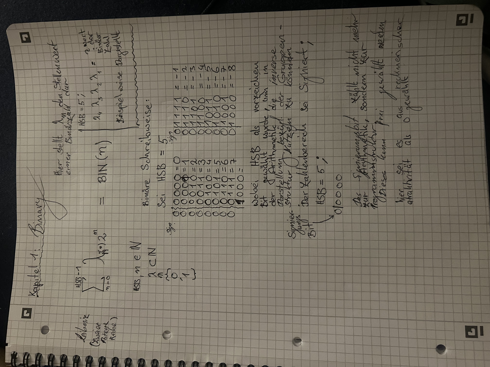
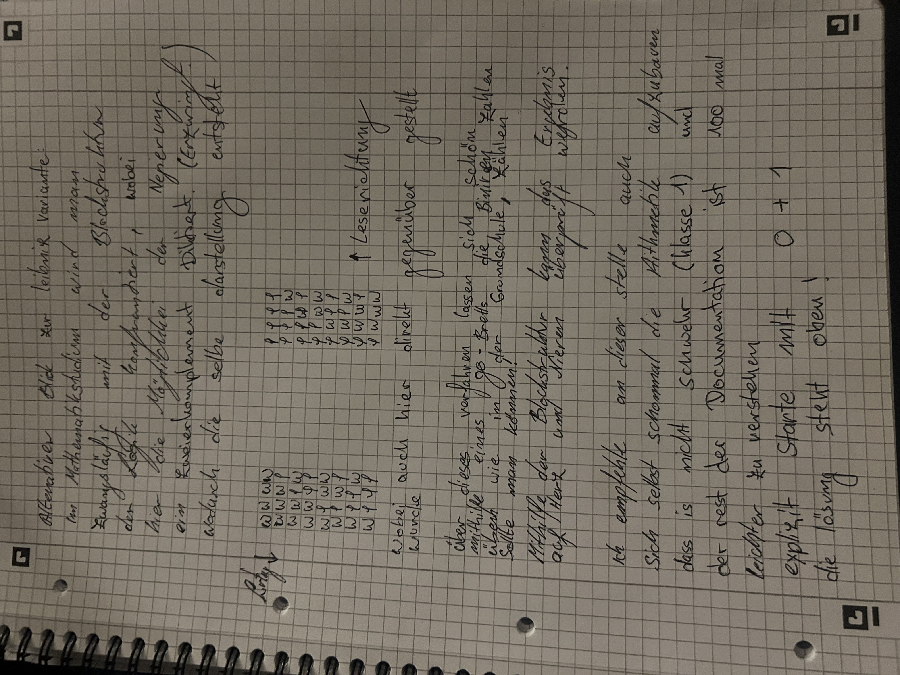

# Aufschriebe: BINARY

Hier ist das originale Protokoll meiner Notizen:
activly workin on this, there are errors: 1.BIN(n) is more like BIN(y) were y is countin the ((Byte1/2structure)) and n the ((Bit-structure))

